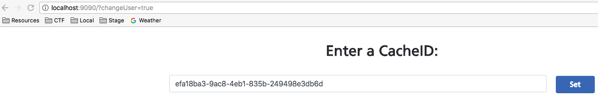
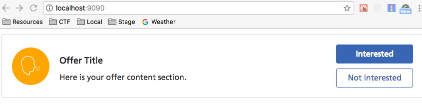

# MyOptum Libraries

Libraries the myoptum.com page team has created for external consumption. Currently features Offers.

## Getting running

To use this library, clone this repo, and navigate into the repo. In the command line, run:

`git clone https://github.optum.com/MyOptum/myoptum-libraries.git`
then
`cd myoptum-libraries`

Next, pull down the project's dependencies using npm:
`npm install`

The project should now be ready to go. You can take two actions from here:

1. Run the project in a local environment
2. Build the library for use in another project

### Running Locally

To run the project locally, run
`npm start`

The first time you visit the page, you'll need to set a cacheId to retrieve offers for. Do this by visiting http://localhost:9090/?changeUser=true, and entering in a valid cacheId for a user who has offers. Press the 'Set' button, and you'll be redirected to the app page.

If the cacheId you enter is invalid, or the user does not have offers, the screen will appear blank. Check the console for more detailed errors. (Note: more advanced error handling to come in future versions).

The offers should appear something like the following:

### Building for production

To build the project, run
`npm run-script build`
This will compile your code and place it in a new 'dist' folder of this project. This folder contains everything you need for integrating into your app.

### Integrating with your project

To use this compiled code in another project, copy the contents of the 'dist/production' directory from myoptum-libraries into a folder in your project. Then, load the offers.js script in your root html file.

For an example, if you copy the contents of dist into a 'vendors/offers' directory, you would load the file like this:

    

Next, in a script tag beneath the above script, add the following script:

    

For the offers to load successfully, you MUST pass the cacheId inside an object with a key of 'cacheId'. Do this inside the initialize method.

This will initialize the offers script, and make it available on your page. Now, you're ready to include the tag for offers in your project's code. You can place it anywhere in the <body> tag. For example:

    <!DOCTYPE html>
    <html>
    <head>
    ...
      
       </body>
    </head>
    <body>
      <h1>My MyOptum Offers Integration</h1>
      <main>
        
Thanks for looking at all these offers!

        <myoptum-offers></myoptum-offers>
      </main>
    </html>

## Dev Tools

When running this app in either the 'develop' or 'stage' environment, the following tools will be available to use.

## Cache Id Changer

The CacheId changer allows you to set a real cacheId for the user in the app, which will make eligible requests for that user. To use this service, visit http://localhost:9090/?changeUser=true. Next, paste the cacheId into the input field, and click the blue button. This will redirect you to the secure page using the entered cacheId.

### Mock Data

The Mock Data tool allows you to view the app with mock data. To use this service, visit http://localhost:9090/?useMockData=true. When using this service, the app will make all requests to local json files, rather than the actual service endpoints.
